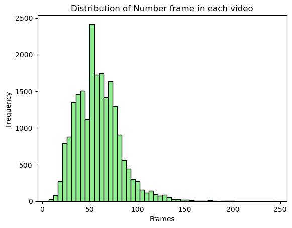
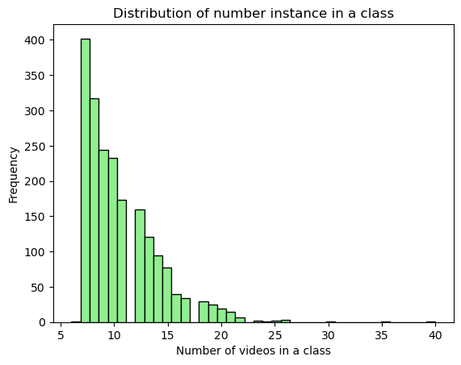
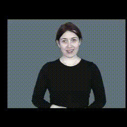
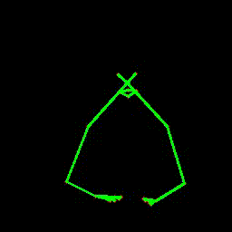
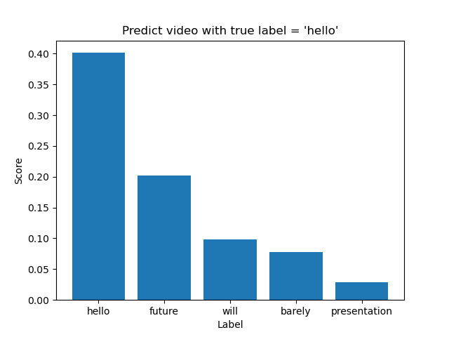

# Skeleton-approach for Sign Language Recognition on WLASL2000 dataset

_Bachelor's Thesis 2024, Hanoi University of Science and Technology 📖_

_One love, one future ❤️_

## Introduction

Sign language is a complex communication system that utilizes hand gestures, body postures, and facial expressions to convey meaning. Traditional sign language recognition approaches primarily rely on RGB video data and employ 3D-CNNs to model spatial and temporal information. However, 3D-CNNs demand large training datasets and significant computational resources. With recent advancements in human pose estimation, skeleton-based recognition has gained attention due to its robustness to background variations and signer's clothing. Additionally, the advent of deep learning has led to the emergence of Graph Convolutional Networks (GCNs), which demonstrate promising performance in representing and recognizing skeletal-based actions. This thesis delves into the following aspects of sign language recognition:

1. **Evaluating the Impact of Pose Estimation Quality**: Assess the influence of human pose estimation accuracy on the recognition performance of the proposed model.

2. **Keypoint Selection Strategy for Graph Convolutional Networks**: Investigate effective strategies for selecting keypoints to enhance the performance of graph convolutional networks in sign language recognition.

3. **Incorporating Natural Language Knowledge**: Explore methods to incorporate natural language knowledge into sign language recognition to improve overall performance.

## Dataset Preparation

WLASL Dataset HomePage: https://dxli94.github.io/WLASL/

WLASL is the largest video dataset for Word-Level American Sign Language (ASL) recognition, which features 2,000 common different words in ASL

Split 4 subsets $K=100,300,1000,2000$ . Statistics on training, validation and testing on each subset of the WLASL dataset:

| Datasets  | Gloss | Videos | Mean  | Train | Val  | Test |
| --------- | ----- | ------ | ----- | ----- | ---- | ---- |
| WLASL100  | 100   | 2038   | 20.38 | 1442  | 338  | 258  |
| WLASL300  | 300   | 5117   | 17.06 | 3549  | 900  | 668  |
| WLASL1000 | 1000  | 13168  | 13.17 | 8974  | 2318 | 1876 |
| WLASL2000 | 2000  | 21083  | 10.53 | 14289 | 3916 | 2878 |

| <center> Distribute the number of frames in each video </center>           | <center> Distribute the number of videos in each class </center>                |
| -------------------------------------- | ------------------------------------------- |
|  |  |

## Data preprocessing

### 1. Generate whole-body skeleton keypoints

In this report, we using RTMPose inference with ONNXRuntime to extract 133 landmarks from WLASL2000 videos and save as .pkl format for each video.

To experiment with different whole-body pose estimator, we use 2 version of RTMPose: RTMPose-l and RTMW-l+. In addition, we compare with HRNet-w48-Dark Whole-body Pose-estimator, which used in previous paper

| Pose estimator | Input size       | AP   | GFLOPs | Download                                                                                                                                       | Source                                                                                 |     |
| -------------- | ---------------- | ---- | ------ | ---------------------------------------------------------------------------------------------------------------------------------------------- | -------------------------------------------------------------------------------------- | --- |
| RTMPose-l      | $256 \times 192$ | 62.1 | 4.52   | [onnx](https://download.openmmlab.com/mmpose/v1/projects/rtmw/onnx_sdk/rtmw-dw-x-l_simcc-cocktail14_270e-384x288_20231122.zip)                 | [RTMPose](https://github.com/open-mmlab/mmpose/tree/dev-1.x/projects/rtmpose)          |
| HRNet-w48-Dark | $384\times 288$  | 66.1 | 35.52  | [pth](https://download.openmmlab.com/mmpose/top_down/hrnet/hrnet_w48_coco_wholebody_384x288_dark-f5726563_20200918.pth)                        | [MMPose](https://mmpose.readthedocs.io/en/latest/model_zoo/wholebody_2d_keypoint.html) |
| RTMPose-l+     | $384\times 288$  | 70.1 | 17.7   | [onnx](https://download.openmmlab.com/mmpose/v1/projects/rtmposev1/onnx_sdk/rtmpose-l_simcc-ucoco_dw-ucoco_270e-256x192-4d6dfc62_20230728.zip) | [RTMPose](https://github.com/open-mmlab/mmpose/tree/dev-1.x/projects/rtmpose)          |

**Usage**

```bash
python genpose.py \
    --onnx-path {ONNX_PATH} \
    --video-data-path {VIDEO_DATA_PATH} \
    --device {DEVICE} \
    --save-path {SAVE_PATH}
```

**Description of all arguments**

- `ONNX_PATH`: The path of onnx file
- `VIDEO_DATA_PATH`: The path of WLASL2000 dataset
- `DEVICE`: The device to run the model, default is `cpu`
- `SAVE_PATH`: The path to save output results (.pkl format for each video)

Example run WHPE RTMW-l+:

```
python genpose.py --onnx-path "D:\DATN\project\Pose-based-WLASL\onnx_model\rtmw-dw-x-l_simcc-cocktail14_270e-384x288_20231122.onnx" --video-data-path "D:\dataset\rgb_WLASL2000\WLASL2000" --device "cpu" --save-path "./keypoints_rtmpose_wholebody/"
```

### 2. Word Embeddings

We use fastText trained on Common Crawl. The pretrained word embeddings can be downloaded from [here](https://dl.fbaipublicfiles.com/fasttext/vectors-english/crawl-300d-2M-subword.zip).

### 3. GCN model

#### 1. ST-GCN

Link paper: https://arxiv.org/abs/1709.04875

#### 2. ST-GCN++

Link paper: https://arxiv.org/abs/2205.09443

#### 3. CTR-GCN

Link paper: https://arxiv.org/abs/2107.12213

## Pretrained models and whole-body skeleton keypoints

Pretrained models and whole-body skeleton keypoints extract from different Pose-Estimator can be downloaded via [Google Drive](https://drive.google.com/drive/folders/1gkDuLriy5K8rk6AntYLGKpap9ugHC8cA?usp=sharing)

## Training

```
python training.py \
    --config ${CONFIG_FILE}
    --weight ${WEIGHT_PATH}
```

Example:

```
python training.py --config "D:\DATN\project\Pose-based-WLASL\configs\ctr-gcn\config.yaml"
```

## Testing

For testing, change attribute of `phase` to `test` on `CONFIG_FILE`

```
python training.py \
    --config ${CONFIG_FILE}
    --weight ${WEIGHT_PATH}
```

**Description of all arguments**

- `CONFIG_FILE`: Path to the configuration file
- `WEIGHT_PATH`: The weights for network initialization

## Result

**Experiment 1:** Experimenting with different WHPEs on the WLASL2000 dataset, with 27 keypoints and the CTR-GCN model.

|     WHPE      |   Input size    |  AP  | GFLOPs | Top-1 PI  | Top-5 PI  |
| :-----------: | :-------------: | :--: | :----: | :-------: | :-------: |
|   RTMPose-l   | $256\times 192$ | 61.1 |  4.52  |   43.22   |   75.92   |
| HRNet-48-Dark | $384\times 288$ | 66.1 | 35.52  |   49.30   |   83.01   |
|    RTMW-l+    | $384\times 288$ | 70.1 |  17.7  | **53.93** | **85.65** |

**Experiment 2:** : Evaluating the impact of varying keypoint selections on the WLASL2000 dataset, using the RTMW-l+ WHPE with CTR-GCN model.

| Keypoints | Top-1 PI  | Top-5 PI  | Top-1 PC  | Top-5 PC  |
| :-------: | :-------: | :-------: | :-------: | :-------: |
|    27     |   53.93   |   85.65   |   51.18   |   84.59   |
|    31     | **54.20** | **86.76** | **51.78** | **85.90** |
|    49     |   52.46   |   85.12   |   50.33   |   83.90   |

**Experiment 3:** : Evaluating the impact of varying keypoint selections on the WLASL2000 dataset, using the WHPE RTMW-l+ with ST-GCN++ model.

| Keypoints | Top-1 PI  | Top-5 PI  | Top-1 PC  | Top-5 PC  |
| :-------: | :-------: | :-------: | :-------: | :-------: |
|    27     |   53.09   |   85.20   |   50.88   |   84.40   |
|    31     | **54.66** | **86.76** | **52.08** | **86.03** |
|    49     |   52.15   |   84.78   |   49.62   |   83.84   |

**Experiment 4:**: Evaluating the performance of original Label Smoothing and Natual Language-Assisted on the WLASL2000 dataset, using the WHPE RTMW-l+, the ST-GCN++ model, and 31 keypoints.

| $\epsilon$ |   Type   | Top-1 PI  | Top-5 PI  | Top-1 PC  | Top-5 PC  |
| :--------: | :------: | :-------: | :-------: | :-------: | :-------: |
|     0      | One-hot  |   54.66   |   86.76   |   52.08   |   86.03   |
|    0.1     | Vanilla  |   54.93   |   86.66   |   52.56   |   86.05   |
|    0.1     | Language |   55.35   |   86.27   |   52.87   |   85.57   |
|    0.2     | Vanilla  |   56.21   |   87.07   |   53.77   |   86.16   |
|    0.2     | Language |   56.01   |   87.14   |   53.41   |   86.32   |
|    0.3     | Vanilla  |   56.53   |   87.52   |   53.83   |   86.79   |
|    0.3     | Language | **56.46** | **87.94** | **54.03** | **87.18** |

## Visualize result

| <center> RGB video </center>           | <center> Skeleton video </center>                |
| -------------------------------------- | ------------------------------------------- |
|  |  |


| <center> Top-5 Accuracy </center> |
|---|
||

<!-- ## Citations -->

<!-- -- Update -->
